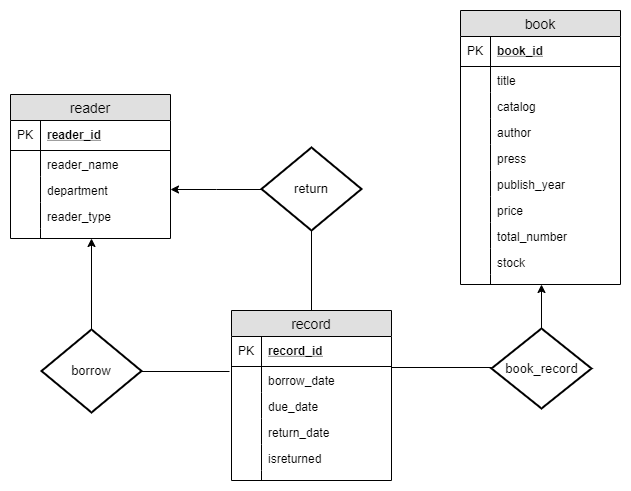

# Library Management

2019-2020数据库系统作业  

一个精简的图书管理程序 , 具有图书入库、查询、借书、还书、借
书证管理等功能。  

* 字符界面  
* MySQL 8.0  
* VC++  
* ODBC数据源（64位）  

----

1. 系统需求  
   1）基本数据对象     

   |       对象名称       |                           包含属性                           |
   | :------------------: | :----------------------------------------------------------: |
   |      书 `book`       |    书号 书名 类别 作者 出版社 出版年份 价格 总藏书量 库存    |
   | 借阅证/读者 `reader` |         借阅证号（卡号） 姓名 院系 类别（教师/学生）         |
   |  借书记录 `record`   | 记录号 书号 借书证号 借出日 期 应还日期（自借出日期起一个月） 归还日期（未归还为NULL） 是否归还标记（N/ Y） |

   2）基本功能模块  

    * **图书入库 ** 

       * 单本入库  
         键盘依次输入：`书号 书名 类别 作者 出版社 年份 价格 数量`  

       *  批量入库  
         图书信息存放在文件中, 每条图书信息为一行。一行中的内容如下：`书号 书名 类别 作者 出版社 年份 价格 数量`
         Sample：`20161112001 中国易学 哲学宗教 刘正 中央编译出版社 2015 20 3`  
         Note:  

         ​	其中`年份`，`数量`是整数类型，`价格`是两位小数类型，其余为字符串。  

         ​	根据`书号`，如果书号在book中已经存在，则添加总量及库存（若除数量外的所有信息相同 ）或修改信息（除书号和数量外有信息不相同）；若book中没有相同的书号，则添加新书。  

    * **图书查询**  

      	* 可以对书的书号/书名/类别/作者/出版社（精准匹配），年份/价格（区间查找）进行查询  
         	* 每条图书信息包括以下内容：`书号 书名 类别 作者 出版社 年份 价格 总藏书量 库存`   

    * **借书**  

       * 先输入借书证卡号  
         显示该借书证所有已借书籍，格式如下：`记录号 书号 借出时间 应还时间 归还时间 是否已还`  
       * 再输入书号  
         如果该书还有库存，则借书成功，同时库存数减一；否则输出该书无库存，且输出最近归还的时间  

    * **还书**  

       * 先输入借书证卡号  
         显示该借书证所有已借书籍，格式如下：`记录号 书号 借出时间 应还时间 归还时间 是否已还`  
       * 再输入书号  
         如果该书在已借书籍列表内, 则还书成功 , 在对应的借阅记录中更新还书时间与是否归还标记，同时库存加一；否则输出出错信息  

    * **借阅证管理**  

       * 删除借阅证  
         输入要删除的借阅证号，若存在该借阅证，则将其删除， 并删除与之关联的所有借阅记录  

       * 增加借阅证  

          * 单次添加  
            键盘依次输入`卡号 姓名 院系 类别`  

          * 批量添加
            图书信息存放在文件中, 每条信息为一行。一行中的内容如下：`卡号 姓名 院系 类别`  
            Sample：`20161101 张雪 英语 学生`  
            Note:   

            ​	根据`卡号`，如果该卡号在reader中已经存在，且信息存在不同，则修改信息；若reader中没有相同的卡号，则添加新借阅证   

       * 借阅证修改  
         输入要修改的借阅证号，可以对借阅证的姓名/院系/类别进行修改  

       * 借阅记录查询  
         输入要查询的借阅证号，查询其对应的所有借阅记录，格式如下：`记录号 书号 借出时间 应还时间 归还时间 是否已还`  

      

2. 实体之间的关系E-R图  

   

   

3. 数据库逻辑结构设计  

    [library.sql](project\library.sql)  （同时还含有一些初始数据，可用于测试功能）

